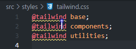

# gogo-vue3-admin

## 项目说明

### 简介

`gogo-vue3-admin`是一款中后台管理系统前端模板，使用了最新的 `Vue3`、 `Vite`、`Element-Plus`、`TypeScript`、`Pinia`、`Tailwindcss` 等主流技术开发。

项目是本萌新练手用的，出现错误在所难免，仅供参考

### 鸣谢

本项目参考以下项目/文档（包括但不限于）：

- vue-pure-admin

### 技术栈

本项目使用 Vue 官方脚手架 [create-vue](https://github.com/vuejs/create-vue) 创建，使用`pnpm`作为包管理工具

- 主要技术栈：Vue3、Vite5、Vue Router、Pinia、Typescript
- 代码规范：ESLint、Prettier

## 安装使用

### 推荐的 IDE 设置

[VSCode](https://code.visualstudio.com/) + [Vue - Official](https://marketplace.visualstudio.com/items?itemName=Vue.volar) (请禁用 Vetur).

### 配置 Vite

See [Vite Configuration Reference](https://vite.dev/config/).

### Project Setup

```sh
pnpm install
```

### Compile and Hot-Reload for Development

```sh
pnpm dev
```

### Type-Check, Compile and Minify for Production

```sh
pnpm build
```

### Lint with [ESLint](https://eslint.org/)

```sh
pnpm lint
```

## 开发过程

**这里记录本项目的开发过程**

### 创建项目

使用`pnpm create vue@latest`创建项目

### 代码规范

#### Prettier

Prettier 在我们创建项目的时候已经自动安装好并且有了默认配置 `.prettierrc.json`，可以按照自己的需求进行更改。

可以创建一个 `.prettierignore` 文件以忽略不需要格式化的文件。

本项目中，删掉了默认的配置文件`.prettierrc.json`，添加了新的`.prettierrc.cjs`

#### ESLint

ESlint 在我们创建项目的时候已经自动安装好并且有了默认配置 `.eslintrc.cjs`，可以按照自己的需求进行更改。

启用 ESLint IDE 插件，比如 [ESLint for VSCode](https://gitee.com/link?target=https%3A%2F%2Fmarketplace.visualstudio.com%2Fitems%3FitemName%3Ddbaeumer.vscode-eslint)，然后你就可以在开发时获得规范检查器的反馈。这同时也避免了启动开发服务器时不必要的规范检查

#### lint-staged

随着项目体量的增大，全量跑一次 lint 的时间越来越长。如果在一次提交的时候，只对这一部分代码做规范化，那将大大缩短 developer 提交代码的速度，于是就诞生了一个工具：`lint-staged。`

当 `lint-staged` 配合 git hooks 使用时，可以在 git 提交前的 hook 中加入 `lint-staged` 命令，这样就能在提交代码之前，对即将提交的代码进行格式化，成功之后就会提交代码

##### 引入 lint-staged

```
pnpm i -D lint-staged
```

在 package. json 中配置 lint-staged

```
  "lint-staged": {
    "src/**/*.{js,jsx,ts,tsx,json,css,vue}": [
      "eslint",
      "prettier --write"
    ]
  }
```

#### commitlint

commitlint 是一个 git commit 校验约束工具。

> 就是当我们运行 `git commmit -m 'xxx'` 时，来检查 `'xxx'` 是不是满足团队约定好的提交规范的工具。

安装

```
pnpm i -D @commitlint/config-conventional @commitlint/cli @commitlint/types
```

配置 `commitlint.config.ts`

```
import type { UserConfig } from '@commitlint/types';
import { RuleConfigSeverity } from '@commitlint/types';

const Configuration: UserConfig = {
  extends: ['@commitlint/config-conventional'],
  rules: {
    'body-leading-blank': [RuleConfigSeverity.Warning, 'always'],
    'body-max-line-length': [RuleConfigSeverity.Error, 'always', 100],
    'footer-leading-blank': [RuleConfigSeverity.Warning, 'always'],
    'footer-max-line-length': [RuleConfigSeverity.Error, 'always', 100],
    'header-max-length': [RuleConfigSeverity.Error, 'always', 100],
    'scope-case': [RuleConfigSeverity.Error, 'always', 'lower-case'],
    'subject-case': [
      RuleConfigSeverity.Error,
      'never',
      ['sentence-case', 'start-case', 'pascal-case', 'upper-case'],
    ],
    'subject-empty': [RuleConfigSeverity.Error, 'never'],
    'subject-full-stop': [RuleConfigSeverity.Error, 'never', '.'],
    'type-case': [RuleConfigSeverity.Error, 'always', 'lower-case'], //type必须小写，否则报错
    'type-empty': [RuleConfigSeverity.Error, 'never'], //type不能为空，否则报错
    'type-enum': [
      RuleConfigSeverity.Error,
      'always',
      [
        'build', //影响构建系统或外部依赖项的更改（示例：gulp、broccoli、npm、webpack）
        'chore', //不修改src或者test的其余修改，例如构建过程或辅助工具的变动
        'ci', //与CI（持续集成服务）有关的改动
        'docs', //只改动了文档相关的内容
        'feat', //增加新功能
        'fix', //修复bug
        'perf', //提升性能的改动
        'refactor', //代码重构
        'revert', //撤销提交（创建一个全新的提交来撤消先前提交所做的更改）
        'style', //不影响代码含义的改动，例如去掉空格、改变缩进、增删分号
        'test', //添加测试或者修改现有测试
      ],
    ],
  },
  helpUrl:
    'https://github.com/conventional-changelog/commitlint/#what-is-commitlint',
};

module.exports = Configuration;
```

#### husky

**husky**可以在项目中植入你设定的 git hooks，在 git 提交代码的前后，你预设的 git hooks 可以得到执行，以对代码、文件等进行预设的检查，一旦检查不通过，就可以阻止当前的代码提交，避免了不规范的代码和 git 提交出现在项目中

本项目使用`husky v9`版本，与 v4 版本用法有区别，请注意

##### 安装

```bash
npm install --save-dev husky
```

##### 初始化

`init` 命令简化了项目中的 husky 设置。它会在 `.husky/` 中创建 `pre-commit` 脚本，并更新 `package.json` 中的 `prepare` 脚本。随后可根据你的工作流进行修改。

```bash
npx husky init
```

##### 使用

以下是使用示例：

###### `pre-commit `

修改 `.husky/pre-commit` 文件内容为：

```bash
npx lint-staged
```

###### `commit-msg`

创建一个 `.husky/commit-msg` 的 hook 文件, 修改文件内容为：

```bash
npx --no-install commitlint --edit $1
```

启用后，以后提交代码时，都会对代码的提交格式进行校验

###### `pre-push`

创建一个 `.husky/pre-push` 的 hook 文件, 修改文件内容为：

```bash
npm run build
```

以上确保我们只有在代码构建成功的时候才可以将代码推送到远程仓库中

### VSCode 配置

现在我们已经实现了 `ESLint 和 Prettier`，我们可以利用一些便利的 VS Code 功能让它们自动运行。

在项目的根目录中有一个名为 `.vscode` 的目录和一个名为 `settings.json` 的文件。 这将是一个覆盖已安装 VS 代码默认设置的值列表。

我们想要将它们放在项目文件夹中的原因是我们可以设置仅适用于该项目的特定设置，并且我们可以通过将它们包含在代码仓库中来与我们团队的其他成员共享它们。

在 *.vscode/settings.json* 中，我们将添加以下值

```json
{
  "explorer.fileNesting.enabled": true,
  "explorer.fileNesting.patterns": {
  "tsconfig.json": "tsconfig.*.json, env.d.ts",
  "vite.config.*": "jsconfig*, vitest.config.*, cypress.config.*, playwright.config.*",
  "package.json": "package-lock.json, pnpm*, .yarnrc*, yarn*, .eslint*, eslint*, .prettier*, prettier*, .editorconfig, commitlint.config.ts, LICENSE"
  },
  "editor.defaultFormatter": "esbenp.prettier-vscode",
  "editor.formatOnSave": true,
  "editor.codeActionsOnSave": {
    "source.fixAll": true,
    "source.organizeImports": "explicit"
  }
}
```

以上将告诉 VS Code 

1. 资源管理器中启用文件嵌套。文件嵌套允许目录中的相关文件在单个父文件下以可视方式组合在一起

2. 使用你的 Prettier 扩展作为默认格式化程序（如果你愿意，可以手动覆盖另一个）并在每次保存时自动格式化你的文件并组织你的导入语句

### VSCode 代码片段

在 `.vscode` 的目录下添加代码片段，在vue文件中输入<kbd>v</kbd>+<kbd>3</kbd>即可快速创建 Vue3.3+defineOptions 组件模板

*vue3.3.code-snippets*

```json
{
	"Vue3.3+defineOptions快速生成模板": {
		"scope": "vue",
		"prefix": "Vue3.3+",
		"body": [
			"<script setup lang='ts'>",
			"defineOptions({",
			"\tname: '$1'",
			"})",
			"</script>\n",
			"<template>",
			"\t<div>$2</div>",
			"</template>\n",
			"<style lang='scss' scoped>\n",
			"</style>",
		],
		"description": "Vue3.3+defineOptions快速生成模板",
	},
}

```

### 安装 SCSS

Vite 提供了对 `.scss`, `.sass`, `.less`等文件的内置支持，所以只需要安装相应的预处理器依赖即可使用

1. 安装scss、postcss

```
pnpm i -D sass postcss

# 如果报错：Error: Cannot find module 'ts-node'，则需要安装ts-node
pnpm i -D ts-node
```

2. 配置 postcss

*postcss.config.cjs*

```ts
module.exports = {
  plugins: {},
};
```

3. 在 `vite.config.ts`中配置

```
export default defineConfig({
  //...
  css: {
    // css预处理器
    preprocessorOptions: {
      scss: {
        // 引入 variables.scss 这样就可以在全局中使用 variables.scss中预定义的变量了。使用@use避免了使用@import导致的重复引入问题，
        additionalData: `@use "@/styles/variables.scss" as *;`,
        api: 'modern-compiler',
      },
    },
  },
});
```

1. 创建全局样式并在 `main.ts`中导入

   ```
   import '@/styles/main.scss';
   ```

> tips
>
> 1. sass 中的 @import 语法已废弃，请改为 @use


### 安装 tailwindcss

[Install Tailwind CSS with Vite - Tailwind CSS](https://tailwindcss.com/docs/guides/vite#vue)

安装完成后，如果有这种警告：

可以在`.vscode`目录中添加`tailwindcss.json`文件，内容如下：

```json
{
  "version": 1.1,
  "atDirectives": [
    {
      "name": "@tailwind",
      "description": "Use the `@tailwind` directive to insert Tailwind's `base`, `components`, `utilities` and `screens` styles into your CSS.",
      "references": [
        {
          "name": "Tailwind Documentation",
          "url": "https://tailwindcss.com/docs/functions-and-directives#tailwind"
        }
      ]
    },
    {
      "name": "@apply",
      "description": "Use the `@apply` directive to inline any existing utility classes into your own custom CSS. This is useful when you find a common utility pattern in your HTML that you'd like to extract to a new component.",
      "references": [
        {
          "name": "Tailwind Documentation",
          "url": "https://tailwindcss.com/docs/functions-and-directives#apply"
        }
      ]
    },
    {
      "name": "@responsive",
      "description": "You can generate responsive variants of your own classes by wrapping their definitions in the `@responsive` directive:\n```css\n@responsive {\n  .alert {\n    background-color: #E53E3E;\n  }\n}\n```\n",
      "references": [
        {
          "name": "Tailwind Documentation",
          "url": "https://tailwindcss.com/docs/functions-and-directives#responsive"
        }
      ]
    },
    {
      "name": "@screen",
      "description": "The `@screen` directive allows you to create media queries that reference your breakpoints by **name** instead of duplicating their values in your own CSS:\n```css\n@screen sm {\n  /* ... */\n}\n```\n…gets transformed into this:\n```css\n@media (min-width: 640px) {\n  /* ... */\n}\n```\n",
      "references": [
        {
          "name": "Tailwind Documentation",
          "url": "https://tailwindcss.com/docs/functions-and-directives#screen"
        }
      ]
    },
    {
      "name": "@variants",
      "description": "Generate `hover`, `focus`, `active` and other **variants** of your own utilities by wrapping their definitions in the `@variants` directive:\n```css\n@variants hover, focus {\n   .btn-brand {\n    background-color: #3182CE;\n  }\n}\n```\n",
      "references": [
        {
          "name": "Tailwind Documentation",
          "url": "https://tailwindcss.com/docs/functions-and-directives#variants"
        }
      ]
    }
  ]
}
```

然后在`settings.json`中添加：

```json
  "css.customData": [
    ".vscode/tailwindcss.json"
  ],
```

> tips
>
> 创建的css文件需要在main.ts中直接或间接导入哦！
